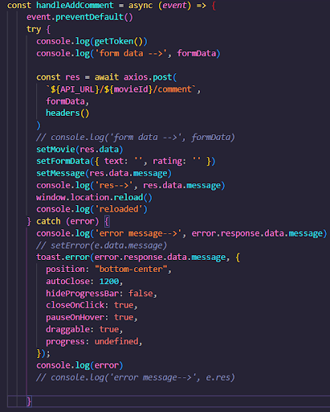

# AMDB Frontend

The objective was to build a full-stack MERN App as part of Software Engineering Immersive module 3 - Node and Express. 

## Deployment link
https://animovies-ga.netlify.app/

##### Preview

Please register on the website and login for full functionality. 

## Timeframe & Working Team (Group)

This was a group project, consisting of 3 individuals, Ridwan Arshad, Fasai Chunchuasuparerk, and Charlie Hird. The timeframe for the project was 7 days. Information relating to the group was also added to the website via an ‘About’ link within the footer of the website.

##### _Fig.1 Developers_

## Technologies Used

##### _Fig.2 Tech Stack_

## Brief

Consume an API with a separate frontend. It must be a complete product with CRUD (Create, Read, Update, Delete) functionality. A key requirement is that it must have a visually impressive design. It must also be deployed online.

## Planning

We first began by brainstorming the idea for our app and I mentioned that we haven’t seen an IMDB clone only for animated movies. This slowly built towards creating a wire-frame for the app.

We had two ideas for names so I also created the variations so we can see what it may look like.

For the colour palette, I found a few famous animation movies and copied the colours to the wire-frame to decide upon later.

##### _Fig.3 Planning_

The wire-framing was then cemented by using Figma to add in some styling so we could see how we wanted the site to look before moving on to the planning/delegation phase.

##### _Fig.4 Figma_

At this point, we created a Trello board to organise delegated work and to see which work remains outstanding or completed.

##### _Fig.5 Trello_

Once this was completed, a plan was created so that we had a better idea for the flow of the project - along with which components would make up the frontend and backend.

##### _Fig.6+ Planning with Excalidraw_

Jobs were delegated by each of us stating what we could do to get the foundation of the app running. As I understood this module quite well, I suggested I could create the backend and the MongoDb server along with a few pages for the frontend whilst the two other members of the team began working solely on the frontend. We called this phase the ‘skeleton-phase’. Although my responsibility was mainly the backend, I worked with my team on implementing the more difficult aspects such as the watchlist, comments, ratings, search and filter page. I would ensure that I was available to help with all of the complex tasks. I also had a large input in the design of the website and the website name was my idea - voted for by the team as a whole. We were working during the day on Zoom and two people on VS Live Share when partnering up. If working out of hours, I would ensure that the team sent updates to our group Slack as I was in charge of the Git and merging.. I also designed the profile page and the footer/about us page independently. Links open a new tab in the browser.

## Build/Code Process

This project consisted of 4 phases: skeleton, foundations, main and styling.

### Phase 1 - Skeleton: 

Firstly we created a Git repository. It was the first time that the team used GitHub for a group project so I decided to take the lead to understand Git better and ensure that merging data was correctly managed and controlled to reduce merging conflicts. The frontend and backend were created as separate repositories.

The initial phase began with creating a MongoDB server that would host the backend. I then created the backend server.js so that it would be linked to the frontend along with the user and movie schemas/controllers and the seeding data for the API. I also created a few components in the front end at this time so that when we move onto the next phase, the pages will be there to pull the data into.

##### _Fig.7 Connecting to DB_

At this point I began to input data into the seedingData.js so that we would have some information to pull in and work with. 

##### _Fig.8 SeedingData_

When I seeded the database, I was able to then use insomnia to make sure that the data was coming through correctly for the movie and user data.

### Phase 2 - Foundation:

We initially began by linking the registration and login pages with the API and using axios to pull the data in. The requests from the front end were linked to the routes which were created in the backend, along with the user model and user controllers.

As we wanted to ensure that the password was protected, bcrypt was used to encrypt the user’s passwords. 

##### _Fig.9 Routes, models and controllers_

##### _Fig.10 Registration_

A .env file was created alongside the use of dotenv to protect the server address, along with the JWT secret. A .gitIgnore file was also added to ensure that that the env file wasn’t pushed. 

Insomnia and MongoDB Compass was used to ensure that the data was coming through from the frontend to the database.

After the registration and login was created, we then moved onto pulling in the movie data to the front end, which was relatively simple with an axios get request. 

A <Link> was added so that the movies which are pulled in from the database, could be clicked on and which would then direct the user to information about the particular movie they wanted to know more information about. 

### Phase 3 - Main

This phase was the longest and most challenging as it required us to complete the search/filter page so that movies can be filtered and searched using their tags or name.

##### _Fig.11 Search/Filter_

Alongside this, in the single movie page, the comments box was added, allowing users to input their review of a movie. We also added in a rating system which is added onto the movie database via an empty array so that is automatically totalled. A user was required to only be able to leave one review/rating and they must both be input otherwise an error displays:

The total rating for the movie is also displayed on the single movie page.

At this stage, the ability to update and delete the comments was added, ensuring that only the user who created it can have access to this function. 

##### _Fig.12 Comments and rating system_

We also wanted to create a ‘watchlist’ functionality that allows users to save movies which they wanted to watch later to their profile page. To achieve this, routes were created in the backend and additional key of ‘watchlist’ added to the user model as an empty array so that it could be populated by pushing the movie id into the empty array. The user is also able to remove a movie from the watchlist if they wanted to. This completed our CRUD functionality and as such, we have achieved our MVP at this stage giving us time to work only on our additional component.

##### _Fig.13 useEffect for Watchlist_

##### _Fig.14 adding move to Watchlist_

For the user profile, an accordion was used to hold data for the comments that the user has left. This also has the movie image which the user can click to go through to the single movie page and then edit/delete the comments as they wish.

A placeholder image of Woody was used as we wanted to add the ability for the user to be able to upload their own profile image although we didn’t manage to complete this stage.

##### _Fig.15 User profile section_

I also worked on our footer and About section. To keep the theme of animation going, we used profile images of animation characters which we thought we may relate to. These were used as our profile images. Links were also added to images of GitHub and LinkedIn so that anyone browsing the page, liking our creation are able to contact us or see our other projects.

I also included an internet speed test to the footer so that if the page doesn’t display properly they can see if the error was caused by their network issues.

##### _Fig.16 Developers_

At this point most of the site was fully functioning but we wanted to be able to display the errors that we had created the error handler for and also for any other errors we had highlighted on the front end. 

To achieve this, a React library called Toastify was used. First we had to ensure our error messages were coming through from the backend and if it did, the Toastify would be activated. 

Toastify was also used to display other messages such as user login welcome and the logging out message. 

##### _Fig.17 Adding comments_

##### _Fig.18 Comments and ratings with error handling_

## Phase 4 - Styling

At this stage, the deadline for presenting our project was fast approaching so we stopped adding more complex functionality as we had already achieved our MVP and many stretch goals. As such, we wanted to make sure the styling was playful and represented the theme of animation movies. 

## Challenges

There were a few main challenges which occurred for this project.

1. GitHub merge conflicts
- As this was the first time working in collaboration with other people whilst using GitHub, we were unsure of how to handle merge conflicts - independently. To overcome this challenge, I personally took over the role of merging all of our data and ensuring that the conflicts were handled appropriately. I achieved this by ensuring that everyone was working on different branches that weren’t connected to the main. I was then told when they pushed their branch so that I was able to handle merge conflicts as others didn’t know how to. Towards the end when the team had more time to spare, I ensured that I walked them through my process via zoom screen share so that they would know how to handle merge conflicts in the future.

Fig.19 Merge conflicts

2. Team organisation/dynamics.
As this was the first real project with more than two people on a team, initially we created a trello board to track the work flow and who is doing what at any given time. We would have a mini standup in the beginning of the day and also outline what each person was going to do when the day finished. We also kept in regular contact via a slack group channel. 

Unfortunately, during the first few days, it was extremely challenging as there was no ‘team leader’ and even though we had plans in place for what we wanted to achieve by the end of each day, sometimes there was a lack of communication and individuals would end up working on the same thing or without consulting others for big design decision. This also caused issues with merge conflicts and reduced morale as it was taking over someone else’s responsibility e.g. a task assigned to one person was infringed upon by another doing it without saying.

As a result, I took on the titleless role of ‘team leader’, being more assertive about ensuring everyone is working on what they are supposed to, communicating to the group that workload and input should be shared amongst the group and ensuring that updates are provided for what the individuals were working on when working offline, so that everyone is in the loop and updated with regard to the project timeline and outstanding work. I also ensured that no one was assigned to work only on the backend or only the frontend but that everyone had some input for both. This was also when I organised a system for who would be representing the group during the cohort standup as only one person from each group was required to attend whilst the other two continued working on the project. As I was in charge of merging on GitHub, I had to ensure that individuals were frequently Git Pushing so that we had back-ups to fall back on.

3. Connecting the backend and frontend.
We faced a challenge where the frontend and backend were working when we ‘npm start’. The issue wasn’t clear as the code was working for me but not for the other two members. I found that they weren’t using the correct localhost address but this was not the only issue. For some reason, still unbeknownst to us as to what happened, but the .env file which we were using for the MongoDb data connection, the JWT secret and the port address, wasn’t being pushed to the repository even though it wasn’t included within a gitignore file. As such we had to keep adding the file after pulling from main.

4. Getting the search/filter and ratings function to work.
This feature was relatively new to us and  it was a bit complicated. As such two of us were working on these complex components together so we could get them completed quicker. We managed to get the whole site to workout using this approach instead of getting outside help. The only part that we needed some help with was the ratings section. For this we needed to create a virtual schema which pulled the data into the movie model.

##### _Fig.20 Average movie rating_

5. Issue pulling through the error messages.
This challenge was more frustrating than it was difficult. I had followed the process of error handling correctly but the data wasn’t coming through from the backend to the frontend. To avoid tunnel vision, I asked a team member if they could see something I may have been missing. After a while of working together on it, the issue was resolved by .send the message, instead of .json, and inserting a missing pair of curly brackets in the backend.

## Wins

I am particularly proud of how much the team changed from the first day in comparison to the last few days. The communication was far better. I won over the trust of my team who then kept asking me for help with regards to their code. This spilled over to other groups asking me to go through their code with them and help them to deploy their project too. I ensured that any aspects that the team were working on, if I thought it would be complicated, such as creating the watch-list, I would provide excellent documentation on it and be available for any questions. I was also keeping morale high by having little group contests - such as creating a tally of who would talk the most whilst still on mute - and at the end of each day we allowed for 20-30 minutes of downtime within the group where we messed around with zoom filters to lighten the mood.

A piece of coding that I was particularly happy about - one that only I had input in - was  the seeding data and the models. We had an idea of what we wanted to accomplish - such as pulling trailers, movie stills, movie posters and additional information of each movie - but wanted the experience of using MongoDb to create my own API. This bit of coding wasn’t so ‘sexy’ as it’s often easy to overlook but a lot of hard work was put into it to find high quality images that would tell a story of what the movie is like, and ensure that everything worked as it should.

##### _Fig.21 Movie schema_

Another notable win was the managing to get our styling to match the wire-frame and figma modelling which was created in the beginning. Due to our organisation and time management, we managed to achieve a lot of our stretch goals increasing the overall quality and design of the page whilst being able to explore and use new technologies. 

## Key Learnings/Takeaways

I learned to use Git and GitHub in ways I have never done before. Being the main point of contact for the team on this also provided me with the confidence to resolve the merging conflicts and put systems in place that would reduce the overall merge conflicts from occurring in the first place. 

I also became more confident with the use of bootstrap and other libraries which we used - such as Toastify. 

As I was in charge of the MongoDB server, I am confident with being able to create and deploy new databases. I’ve also been able to help other individuals on the cohort, outside of my own team members, who have begun asking me for advice on what the process is. 

Being the working ‘team leader’ I learned how to be assertive, organise the project and team members whilst also reducing any potential inter-personal conflicts which would arise. If there was an issue that a member wasn’t comfortable to talk to me about within a group setting, I made it known that I was available to talk privately at any stage.

Overall I would say I am far better acquainted with knowledge of CRUD functionality within a MERN stack. I’m confident that I could try to implement this knowledge and possibly explore other combinations which are used in the tech industry, such as Next.js and GraphQL, as I am far more confident in my ability to produce high quality work whilst having a firm understanding in the processes I use. 

I am also more comfortable working on a full-stack application, using two different project folders for the backend and frontend, and then being able to deploy these separately on two different platforms - Heroku for the backend and Netlifly for the frontend.

During the module, I was helping the instructor of module 3 when he couldn’t see what error he had made - to the extent where he would stop the class and mention that Ridwan would need to help him find the error again - I happily obliged. I also built on this during project 3. This is also why I had a hand in every section of our project - even those that weren’t allocated to me as I was requested for help - some issues took longer to fix than others. I really enjoyed the thrill of fixing the error.

## Bugs

An issue which I noticed is that for the comments section, when a new comment is left, the whole page refreshes to then display this. I would explore this so that only the comments component refreshes. Other than this there are not many noticeable ‘bugs’. Most of the outstanding issues are due to focusing on getting the core functionality to work due to tight time constraints e.g. the error handler not highlighting that a user has already left a comment.

## Future Improvements

* Additional styling for the ‘landing’ page so that the posters appear far bigger than they are now.
* Adding in arrows or a slide bar to scroll sideways along the movies.
* Dynamically creating the movie tags from the seeding data than hard coding it in.
* Adding a ‘dark mode’ functionality to the page.
* Creating links to where the user can watch the movie right now.
* Able to edit user details from the profile page.
* Ability to upload a user's own profile photo.
* Ability for users to upload new movies to the DB or pick an avatar from a set collection.
* Creating a social dynamic to the webpage where users can leave more than just movie reviews.
* Create a recommended movie selection on the homepage - where there is an empty area besides the ‘ANIMOVIES’ based on favourite movies a user enters upon registration. This would only be displayed if a user registers and is logged in. This would also be updated with the movies a user adds to the ‘watchlist’.
